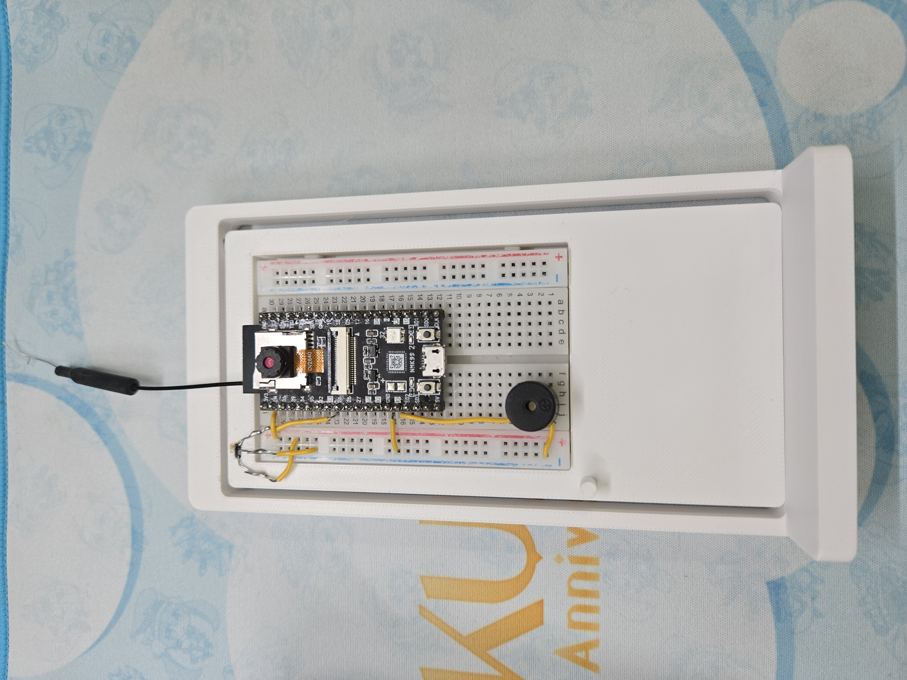

# FaceGuard：ESP32 智慧門口警戒保全系統

[](LICENSE)
[](https://platformio.org/)
[](https://www.arduino.cc/)
[](https://isocpp.org/)
[](https://www.espressif.com/)
[](https://mqtt.org/)
[](https://discord.com/)
[](https://github.com/Ning0612/esp32-faceguard/actions/workflows/ci.yml)

ESP32 NMK99 + OV2640 Camera 實現的可獨立運作門口監控系統。整合人臉辨識、霍爾感應器門禁、RGB LED 警戒狀態、蜂鳴器警示、Discord Webhook 通知，以及本機 WebUI 管理介面。

> 📚 **課程**：114.2 EE5325701 物聯網系統應用與設計實務（Design and Application in Internet of Things）  
> 👤 **學生**：B11115024 王政甯

## 專案狀態

本專案是 114.2 臺科 EE5325701「物聯網系統應用與設計實務」期末專案的整理版。課程展示與公開整理已完成，後續不再持續維護。

## 實體照片



## Demo 片段


- [已知人臉 - 開門 / 回家紀錄](docs/demo/known-face-home-record.mp4)
- [未知人臉 - 發警報](docs/demo/unknown-face-alert.mp4)
- [未偵測到人臉 - 開門出門 / 根據天氣提示語音通知](docs/demo/no-face-weather-voice.mp4)

## 功能概覽

| 功能 | 說明 |
|------|------|
| 人臉辨識 | 輕量 HOG-lite 演算法（64-dim），cosine similarity，不依賴大型 CNN |
| 門禁偵測 | 霍爾感應器 ADC 讀取，去彈跳，DoorState 轉換 |
| 警戒燈號 | WS2812B RGB LED，GREEN / YELLOW / RED + 閃爍告警 |
| 蜂鳴器告警 | 偵測未知訪客時觸發 |
| Discord 通知 | 啟動 IP 公告、已知使用者回家、未知訪客告警 |
| 本機 WebUI | 設定、人臉管理、日誌查詢 |
| Agent 2 協作 | MQTT 交換室內佔用狀態與警報決定（Broker 支援 Username/Password 認證） |
| 離線獨立運作 | Agent 2 離線時自動 ALERT_RED 模式獨立警戒 |

## 快速開始

### 1. 需求

- ESP32 NMK99（**推薦**；GPIO 32 之 CAM_PWDN 未接線，可用於 WS2812B）
  或 AI Thinker ESP32-CAM 相容板（需確認 GPIO 32 的 CAM_PWDN 未接線，否則相機與 LED 衝突）
- 需要 PSRAM
- OV2640 Camera
- WS2812B RGB LED（接 GPIO 32，需對應板子上 PWDN 未接線）
- 霍爾感應器（接 GPIO 33）
- 壓電蜂鳴器（接 GPIO 13）
- PlatformIO IDE 或 CLI

### 2. 編譯與燒錄

```powershell
# 編譯
& "$env:USERPROFILE\.platformio\penv\Scripts\pio.exe" run -e faceguard

# 燒錄（替換 COM3 為實際埠號）
& "$env:USERPROFILE\.platformio\penv\Scripts\pio.exe" run -e faceguard -t upload --upload-port COM3

# 開啟串列監視器
& "$env:USERPROFILE\.platformio\penv\Scripts\pio.exe" device monitor --port COM3
```

> **安全提醒**：`platformio.ini` 預設啟用 `DISCORD_TLS_INSECURE`（停用 TLS 憑證驗證），**僅限開發與測試環境使用**。  
> 生產部署前請移除 `-D DISCORD_TLS_INSECURE`，改用 `-D DISCORD_ROOT_CA_CERT="..."` 設定 Discord 根憑證，詳見 [部署說明](docs/deployment.md)。

### 3. 首次設定

1. 首次開機（或無 WiFi 憑證）→ 裝置開啟 AP 熱點 `FaceGuard-Setup`（密碼：`faceguard99`）
2. 以手機或電腦連線，瀏覽 `http://192.168.4.1`
3. 選擇 WiFi SSID，輸入密碼，按「儲存」
4. 裝置重啟後連上 WiFi，Serial 印出 IP
5. 瀏覽 `http://<裝置IP>/` 或 `http://faceguard.local/`
6. 預設密碼 `admin`（登入表單僅有密碼欄位），首次登入需設定新密碼
7. 前往 `/settings` 設定 Discord Webhook、MQTT Broker（含可選 Username/Password）等參數；**MQTT 設定需重啟才套用**

## 文件索引

| 文件 | 說明 |
|------|------|
| [開發指南](docs/development.md) | 環境設定、Build、燒錄、除錯 |
| [硬體接線](docs/hardware.md) | GPIO 配置、接線圖、感應器安裝 |
| [軟體架構](docs/architecture.md) | 模組設計、狀態機、資料流 |
| [WebUI & API](docs/webui.md) | 頁面說明、REST API、Session 認證 |
| [MQTT 協定](docs/mqtt.md) | 主題、訊息格式、Agent 2 通訊 |
| [人臉辨識](docs/face-recognition.md) | 演算法原理、註冊流程、調校 |
| [設定說明](docs/configuration.md) | NVS 金鑰、Config Portal、參數調整 |
| [部署說明](docs/deployment.md) | 生產環境部署、安全設定、故障排除 |

## 專案結構

```
faceguard/
├── src/
│   └── main.cpp              # 主程式（Arduino loop/setup + 所有 callbacks）
├── lib/
│   ├── FaceRecognizer/       # 人臉特徵萃取、比對、NVS 儲存
│   ├── FaceVoter/            # 時間窗投票（防單 frame 誤觸）
│   ├── CameraAgent/          # Camera 初始化、MJPEG stream、偵測排程
│   ├── DoorSensor/           # 霍爾感應器 ADC 驅動
│   ├── LedController/        # WS2812B RGB LED 驅動
│   ├── BuzzerController/     # 蜂鳴器驅動
│   ├── SecurityStateMachine/ # 核心警戒邏輯（AlertLevel 計算）
│   ├── AgentComm/            # MQTT publish/subscribe
│   ├── DiscordNotifier/      # Discord Webhook HTTPS 通知
│   ├── ConfigPortal/         # WiFi AP 設定入口
│   ├── ConfigManager/        # MQTT 與蜂鳴器設定 NVS 管理
│   ├── SettingsStore/        # 密碼、Discord URL、霍爾閾值 NVS 管理
│   ├── SessionAuth/          # Session token、CSRF、暴力破解防護
│   ├── DashboardServer/      # HTTP 路由、PROGMEM HTML、AJAX API
│   └── LogManager/           # Face/Door/Alert 記憶體環形緩衝 + SPIFFS 月份分頁歷史日誌
├── include/
│   ├── config.h              # 所有計時常數
│   ├── pins.h                # GPIO 腳位定義
│   ├── states.h              # 狀態 enum 與輔助函式
│   └── messages.h            # MQTT 主題與 JSON 欄位常數
├── platformio.ini            # PlatformIO 建置設定
└── docs/                     # 完整文件
```

## 第三方程式庫

以下為 `lib_deps`（應用層）相依程式庫（版本為 `platformio.ini` 中的 semver constraint）：

| 程式庫 | 版本 | 授權 | 說明 |
|--------|------|------|------|
| [ArduinoJson](https://arduinojson.org/) | ^7 | MIT | JSON 序列化／反序列化 |
| [PubSubClient](https://github.com/knolleary/pubsubclient) | ^2.8 | MIT | MQTT 客戶端 |
| [Adafruit NeoPixel](https://github.com/adafruit/Adafruit_NeoPixel) | ^1.12 | LGPL-3.0-or-later | WS2812B 可定址 LED 驅動 |

框架層依賴（[Arduino ESP32 Core](https://github.com/espressif/arduino-esp32)、ESP-IDF、OV2640 Camera driver 等）各自依其上游授權（Apache-2.0、LGPL-2.1-or-later 等）。發佈韌體 binary 時請確認已滿足 LGPL 之原始碼告知義務。

## 授權

MIT License — 詳見 [LICENSE](LICENSE)

Copyright (c) 2026 王政甯（B11115024）
